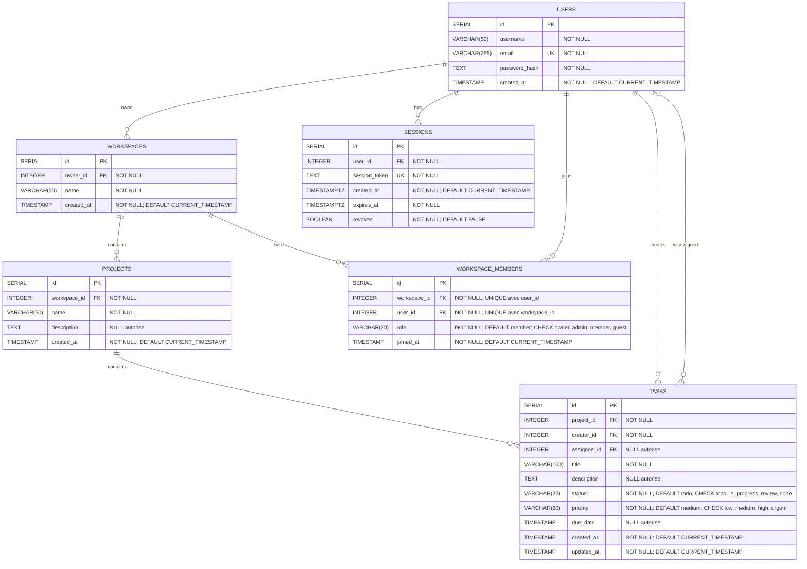

Schéma défini dans [01-init.sql](../app/sql/01-init.sql).

- Toutes les clés étrangères utilisent `ON DELETE CASCADE`, sauf `tasks.assignee_id`, qui utilise `ON DELETE SET NULL` : une tâche peut être non assignée.
- La contrainte `UNIQUE (workspace_id, user_id)` interdit plusieurs adhésions du même utilisateur au même workspace. Chaque colonne peut contenir des doublons individuellement.
- `tasks.updated_at` reçoit une valeur par défaut à la création ; ce script ne définit pas de déclencheur pour l'actualiser lors des modifications.
