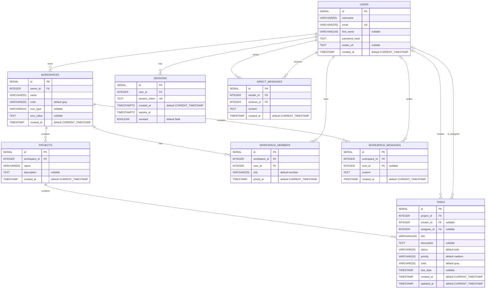

# Database

TaskFlow uses PostgreSQL 17. This document describes the schema defined in [01-init.sql](../app/sql/01-init.sql) and the database operations in [app/db.py](../app/db.py).

## Data model

The database contains eight tables:

| Table | Purpose |
| --- | --- |
| `users` | User accounts, password hashes, and profile details. |
| `workspaces` | Shared workspaces, their designated owner, and visual settings. |
| `workspace_members` | Workspace membership and each member's role. |
| `projects` | Projects belonging to a workspace. |
| `tasks` | Project tasks, assignments, priorities, and deadlines. |
| `sessions` | Authentication tokens, expiration dates, and revocation state. |
| `workspace_messages` | Messages posted in workspace chats. |
| `direct_messages` | Messages exchanged between two users. |

In the diagram, `PK` means primary key, `FK` foreign key, and `UK` unique key. Fields are required unless marked `nullable`. Every `id` is a `SERIAL` primary key. The composite membership constraint is listed below the diagram.

## Constraints

| Field or combination | Database constraint |
| --- | --- |
| `users.email` | Unique. Usernames are not unique. |
| `sessions.session_token` | Unique. A user can have multiple sessions. |
| `workspace_members (workspace_id, user_id)` | Unique pair: one membership per user per workspace. |
| `workspace_members.role` | `owner`, `admin`, `member`, or `guest`. |
| `tasks.status` | `todo`, `in_progress`, `review`, or `done`. |
| `tasks.priority` | `low`, `medium`, `high`, or `urgent`. |
| `workspaces.color`, `tasks.color` | `gray`, `blue`, `green`, `yellow`, `orange`, `red`, or `purple`. |
| `workspaces.icon_type` | `emoji`, `image`, or `NULL`. |
| `workspaces.icon_value` | Both icon fields must be `NULL`, or both must be set with a nonblank value after `btrim`. |

Primary keys and unique constraints create their own indexes. The initialization script defines no additional indexes or triggers.

Workspace roles and the designated owner are stored separately: `workspaces.owner_id` references a user, while `workspace_members.role` controls membership permissions. Creating a workspace also creates an `owner` membership in the same transaction. The database does not enforce that the designated owner has a membership, or limit the number of members with the `owner` role.

Task assignee membership, shared-workspace access to direct messages, and the prohibition on messaging yourself are checked by the application, not by SQL constraints. Message content is stored as `TEXT NOT NULL`; the schema does not enforce message length or reject empty strings.

## Deletion behavior

| Referenced record deleted | Effect on dependent records |
| --- | --- |
| Workspace | Deletes its projects, memberships, and workspace messages. Project deletion also deletes tasks. |
| Project | Deletes its tasks. |
| User | Deletes owned workspaces, memberships, sessions, and direct messages sent or received by that user. |
| Task creator or assignee | Sets `tasks.creator_id` or `tasks.assignee_id` to `NULL`. |
| Workspace message author | Sets `workspace_messages.user_id` to `NULL`. |

All foreign keys use `ON DELETE CASCADE` except `tasks.creator_id`, `tasks.assignee_id`, and `workspace_messages.user_id`, which use `ON DELETE SET NULL`. Tasks and workspace messages only survive a user's deletion if their containing workspace is not also deleted through ownership.

## Timestamps and sessions

Session timestamps use `TIMESTAMPTZ`; all other date columns use `TIMESTAMP` without time zone. Creation timestamps and `workspace_members.joined_at` default to `CURRENT_TIMESTAMP`.

`tasks.updated_at` is initialized on insertion, but neither a database trigger nor the current task update query refreshes it. It therefore does not track later edits.

On login, the application creates a session with a 24-hour expiration. Authentication rejects expired or revoked sessions. Logout marks the session as revoked; it does not delete the row. These rules are implemented in [auth.py](../app/routes/auth.py) and [permissions.py](../app/permissions.py).

## Initialization and access

[Docker Compose](../compose.yaml) creates the `taskflow` database and runs these scripts in order when the PostgreSQL data volume is empty:

1. [01-init.sql](../app/sql/01-init.sql) creates the tables and constraints.
2. [02-create-app-user.sh](../app/sql/02-create-app-user.sh) creates the `taskflow_app` login role and grants database connection, schema usage, table `SELECT`/`INSERT`/`UPDATE`/`DELETE`, and sequence `USAGE`/`SELECT` privileges.

The backend connects as `taskflow_app`; the `taskflow` account is used for database administration. Grants apply to the tables and sequences present when the script runs; it does not configure default privileges for future objects.

Data persists in the `postgres_data` volume. Editing initialization scripts does not update an existing database, and the repository currently has no migration framework. An existing database may therefore differ from the schema documented here.

See the [README](../README.md#local-setup) for local setup instructions.
